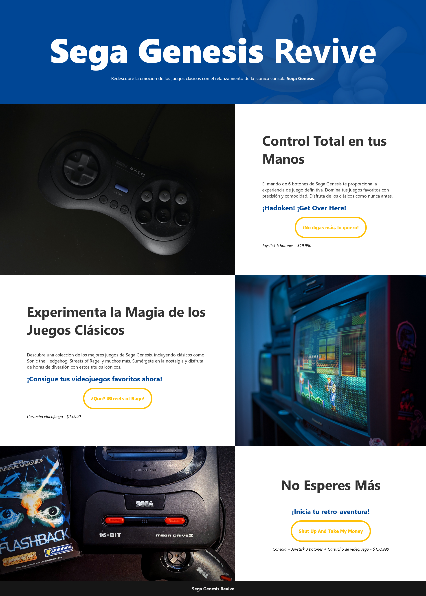

# Desafío 2 - Construyendo un Landing Page

¡Hola, viajero del tiempo y amante de los videojuegos retro!

## Descripción del Desafío 🎮

En este segundo desafío, me sumergí en la creación de un landing page para "Sega Genesis Revive". Una de las principales limitantes ha consistido en el uso de tablas para la organización del contenido. Mi misión: construir una página web que capture la esencia de la icónica consola retro Sega Genesis y invite a los usuarios a revivir la magia de los clásicos.

## Resultado Final 🎉

¡Aquí está el resultado final de mi proyecto!

### Escritorio 💻

## Concepto de la Página 🌐

Mi enfoque se centró en resaltar las características distintivas de Sega Genesis. Desde el joystick de 6 botones hasta la emocionante colección de videojuegos clásicos, la página está diseñada para evocar nostalgia y emoción entre los fanáticos de los videojuegos retro.

## Contenido del Desafío 🚀

### 1. Sección Principal

La página comienza con una sección principal que presenta una imagen de fondo evocadora y un mensaje cautivador. La idea es sumergir a los visitantes en la experiencia Sega Genesis Revive desde el primer momento.

### 2. Sección de Productos

Destaco tres productos clave: el joystick de 6 botones, la colección de videojuegos clásicos y una oferta exclusiva que incluye la consola, joystick y cartucho de videojuego. Cada producto se presenta con imágenes atractivas y textos descriptivos para despertar el interés.

### 3. Sección Footer

Al llegar al final de la página, he incorporado un footer con un mensaje que invita a los usuarios a iniciar su propia "retro-aventura". Además, proporciono información de contacto para aquellos que deseen obtener más detalles.

### 4. Integración del CSS

Opté por cargar el CSS desde un archivo externo ubicado en la subcarpeta `css` dentro de la subcarpeta `assets`. Esta estructura ayuda a mantener organizado el código y facilita futuras actualizaciones de estilo.

### 5. Estructura Correcta del HTML

Para garantizar una estructura clara y organizada, utilicé las etiquetas de HTML de manera efectiva, evitando errores comunes. La disposición del HTML refleja de manera coherente la información clave sobre Sega Genesis Revive.

## Estructura de Carpetas 📁

- **`index.html`**: Contiene la estructura HTML de la página.
- **`assets/css/style.css`**: Archivo CSS externo para estilos.
- **`assets/imgs/`**: Carpeta que almacena las imágenes utilizadas en la página.
- **`assets/css/`**: Carpeta para almacenar archivos CSS.

## Cómo Iniciar 🚀

1. Clona este repositorio: `git clone https://github.com/dieherram/landing-page-sega-genesis.git`
2. Abre el archivo `index.html` en tu navegador.
